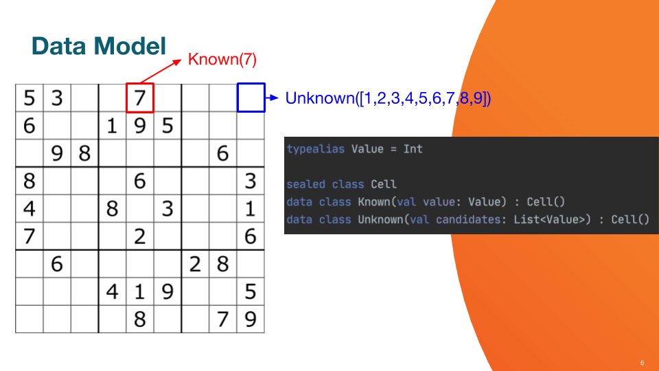

# Functional Sudoku Solver with Kotlin #

This is a simple and naive Sudoku solver in Kotlin. Its goal is to showcase functional concepts such as immutability, pattern matching, use of map and flatMap...

This solution is not particularly efficient and does not solve harder Sudokus which require backtracking.

## Data model ##

